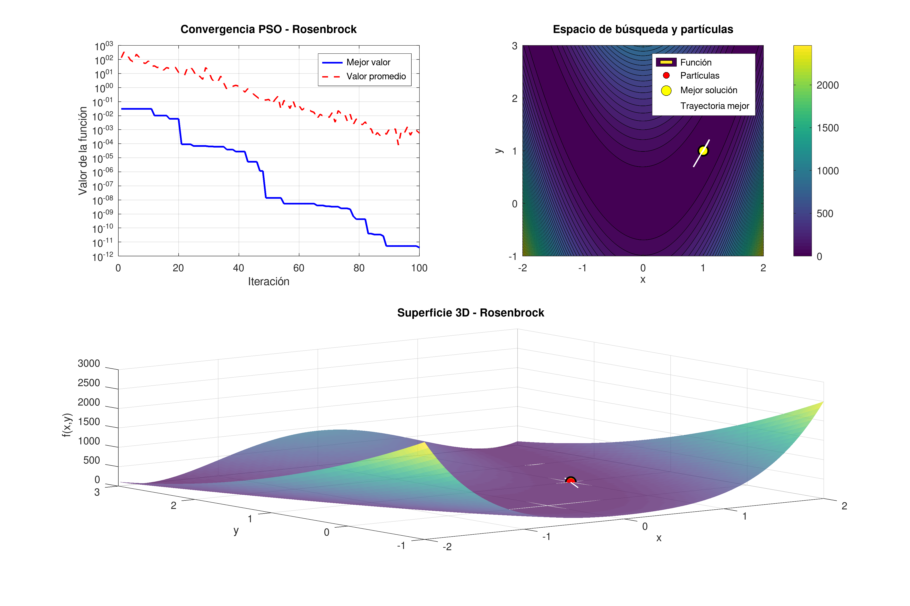

# PSO para funciones Benchmark en 2D

Implementación en GNU Octave del algoritmo Particle Swarm Optimization (PSO) para optimización de funciones objetivo bidimensionales. El proyecto permite evaluar el comportamiento del algoritmo sobre funciones clásicas de benchmark y visualizar la convergencia del enjambre.



## Autor
- Matías Ezequiel Hernández Rodríguez
- Email: matiasehernandez@gmail.com

## Características

* Implementación completa de PSO en GNU Octave.
* Selección interactiva de funciones de prueba.
* Configuración dinámica de:

  * número de partículas.
  * iteraciones.
  * espacio de búsqueda.
* Visualización de:

  * convergencia del algoritmo.
  * distribución de partículas.
  * superficie 3D de la función.
  * trayectoria del mejor global.
* Exportación automática de:

  * resultados en PNG.
  * métricas en TXT.

## Funciones implementadas

1. Sphere.
2. Rosenbrock.
3. Rastrigin.
4. Ackley.
5. Himmelblau.
6. Booth.

## Parámetros PSO

| Parámetro               | Valor   |
| ----------------------- | ------- |
| Inercia (`w`)           | 0.729   |
| Factor cognitivo (`c1`) | 1.49445 |
| Factor social (`c2`)    | 1.49445 |

## Requisitos

* GNU Octave 6+ (compatible)

## Ejecución

### GNU Octave (Debian/Linux)

Instalar Octave:

```bash
sudo apt update
sudo apt install octave
```

Ejecutar desde terminal:

```bash
octave pso.m
```

## Flujo de ejecución

El programa solicita:

1. Función de benchmark.
2. Número de partículas.
3. Número de iteraciones.
4. Límites del espacio de búsqueda.

Posteriormente ejecuta el algoritmo PSO y genera visualizaciones y archivos de salida.

## Salidas generadas

### Imagen de resultados

```text
pso_resultados_<funcion>_p<particulas>_i<iteraciones>.png
```

### Archivo de datos

```text
pso_datos_<funcion>_p<particulas>_i<iteraciones>.txt
```

## Estructura del algoritmo

1. Inicialización aleatoria de partículas.
2. Evaluación de fitness.
3. Actualización de mejores posiciones:

   * mejor personal (`pBest`).
   * mejor global (`gBest`).
4. Actualización de velocidades y posiciones.
5. Evaluación de convergencia.
6. Visualización y exportación de resultados.

## Ejemplo de salida

```text
Iteración 100: Mejor valor = 2.341245e-08 en (0.0001, -0.0002)
```

## Licencia

Este proyecto está bajo la licencia MIT (ver el archivo LICENSE para más detalles).


